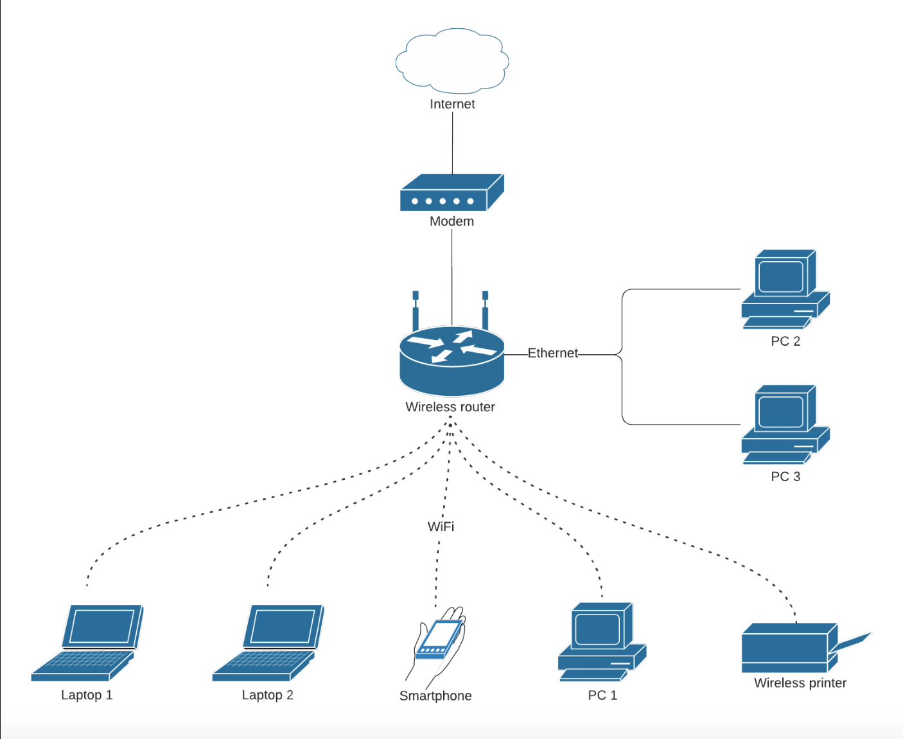
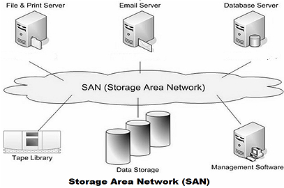
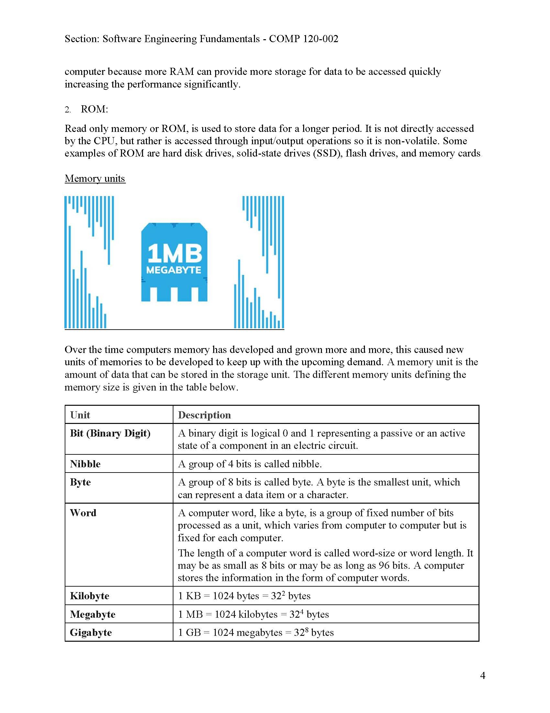
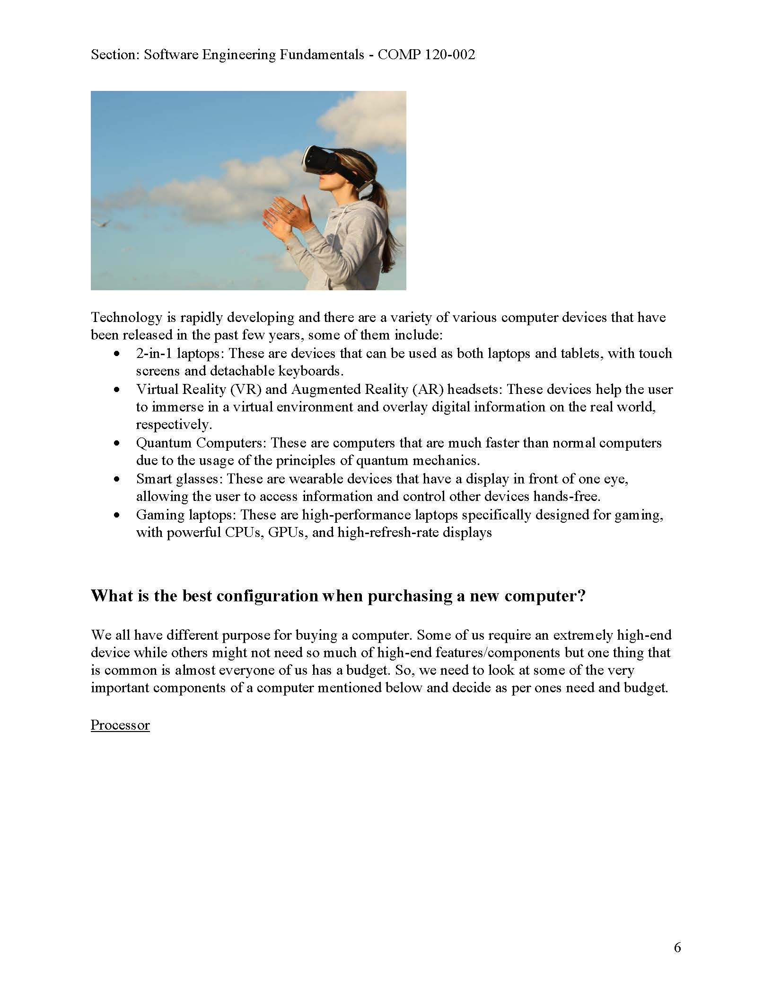
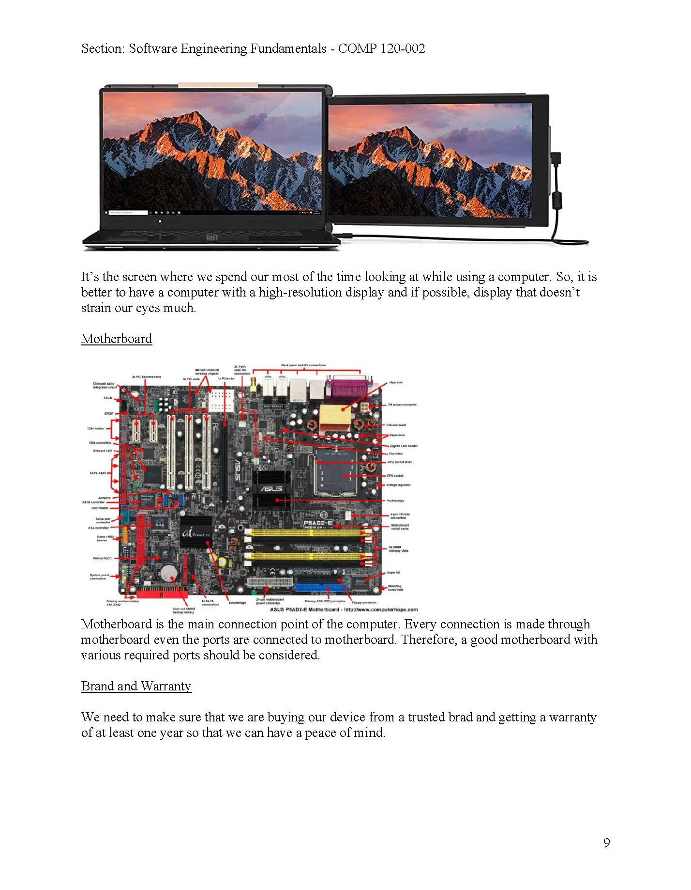
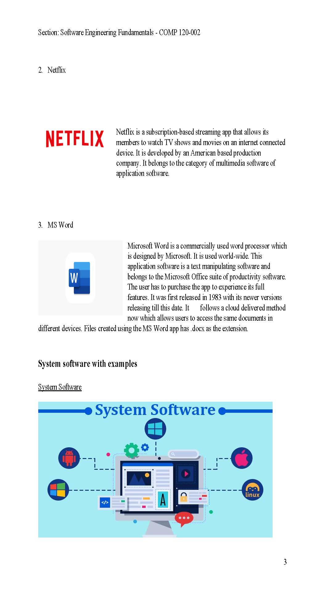
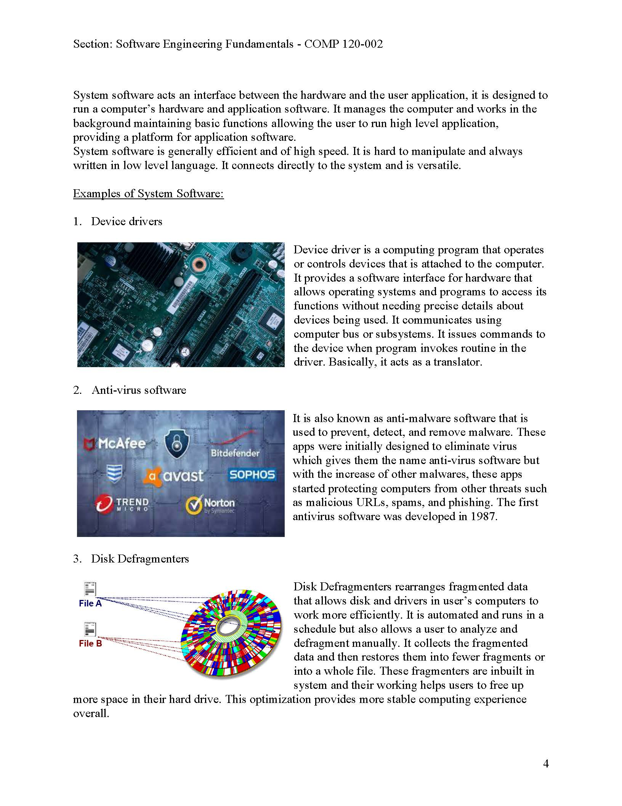
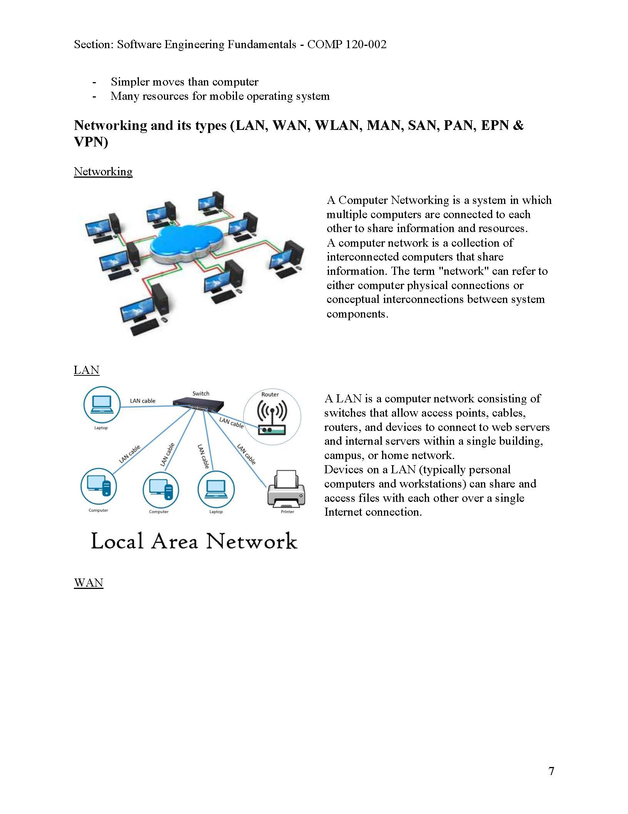
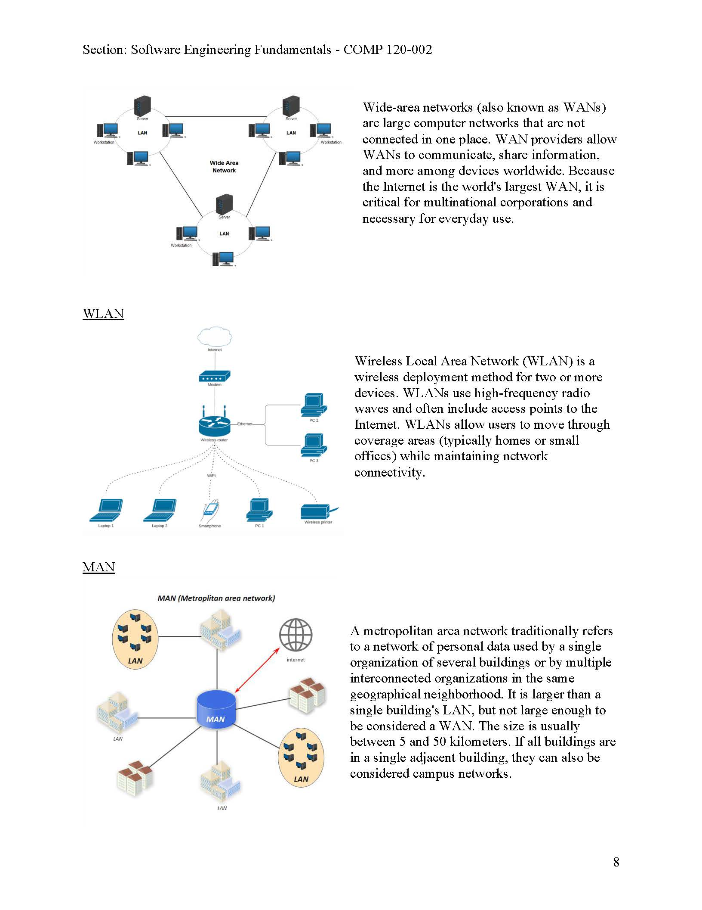

<!-- 

📋 This is the tech-news archives to help me keep track of what I am interested in!

- Reference tech news link: <https://thenextweb.com/news/blockchain-development-tech-career>
  

{{ notice-2 | markdownify }}
 -->

📋 This is my note-taking from what I learned in the class "Software Engineering Fundamentals - COMP 120-002"
{: .notice--danger}

## Lab 1

### Instructions

- Objective: Learn about computer peripherals and hardware.
- Describe computer components, include pictures
- Include header – student name and section, include page number in the footer
- Include cover page and page border
- Include 5 to 10 pages excluding the cover page and references
- Use Times New Romans, single spaced, and 12 size.
- Put the reference at the end of the document.
- Use APA for reference format.

### Question 1:

Describe computer components, include pictures

1. Computer architecture
   : Computer architecture refers to the overall design and organization of a computer system. Functional units of a system such as the Central Processing Unit (CPU), memory, and input/output devices, including the way in which these units are connected to each other are all encompassed in it. Key factors such as performance, power consumption, and cost are considered by computer architects when designing a computer system. Some examples for computer architecture include Von Neumann, Harvard, and RISC (Reduced Instruction Set Computing) architectures.

2. CPU
   : A CPU (Central Processing Unit) AKA the processer is the primary component of a computer. Also referred as the brain of the computer the CPU performs most of the processing. Tasks are done by retrieving important instructions from the memory of the computer and decoding them to execute the given task. The CPU is located on the motherboard and can come in single or multiple cores depending on the amount of performance needed by the user. They are heat-generating components which can produce up to 110° C. The clock speed of the CPU is calculated in GHz, it determines the number of instructions that can be executed per second. Modern day CPUs also include a cache, a small amount of memory which is fast enough for the CPU to access quickly to speed up processing.

3. IO devices
   : Input/output devices are hardware components that helps a computer to access and communicate with the outer world and the user. They allow data to be transferred from computer to other devices, such as a keyboard, mouse, monitor, printer, or storage devices. For example, a keyboard allows users to input texts and commands, a monitor allows users to view the output of the computer. Furthermore, there are storage devices such as hard disks, flash drives, and memory cards that are used for both input and output depending on the operation.

4. Memory &rarr; There are two types of memories in a computer, RAM’s, and ROM's.
   : - RAM: Random Access Memory, or RAM, is a type of memory used in computers that stores data so that the CPU can access it quickly. It acts as a temporary storage for data and instructions that are currently being processed by the CPU. RAM is temporary, meaning all the files in it are deleted when the computer is powered off. Having more RAM affects the performance of the computer because more RAM can provide more storage for data to be accessed quickly increasing the performance significantly.
   : - ROM: Read only memory or ROM, is used to store data for a longer period. It is not directly accessed by the CPU, but rather is accessed through input/output operations so it is non-volatile. Some examples of ROM are hard disk drives, solid-state drives (SSD), flash drives, and memory cards.

5. Memory units
   : Over the time computers memory has developed and grown more and more, this caused new units of memories to be developed to keep up with the upcoming demand. A memory unit is the amount of data that can be stored in the storage unit. The different memory units defining the memory size is given in the table below.

   | Unit               | Description                                                                                                                                                                                                                                                                                                                                                |
   | :----------------- | :--------------------------------------------------------------------------------------------------------------------------------------------------------------------------------------------------------------------------------------------------------------------------------------------------------------------------------------------------------- |
   | Bit (Binary Digit) | A binary digit is logical 0 and 1 representing a passive or an active state of a component in an electric circuit.                                                                                                                                                                                                                                         |
   | Nibble             | A group of 4 bits is called nibble.                                                                                                                                                                                                                                                                                                                        |
   | Byte               | A group of 8 bits is called byte. A byte is the smallest unit, which can represent a data item or a character.                                                                                                                                                                                                                                             |
   | Word               | A computer word, like a byte, is a group of fixed number of bits processed as a unit, which varies from computer to computer but is fixed for each computer. The length of a computer word is called word-size or word length. It may be as small as 8 bits or may be as long as 96 bits. A computer stores the information in the form of computer words. |
   | Kilobyte           | 1 KB = 1024 bytes = 322 bytes                                                                                                                                                                                                                                                                                                                              |
   | Megabyte           | 1 MB = 1024 kilobytes = 324 bytes                                                                                                                                                                                                                                                                                                                          |
   | Gigabyte           | 1 GB = 1024 megabytes = 328 bytes                                                                                                                                                                                                                                                                                                                          |
   | Terabyte           | 1 TB = 1024 gigabytes = 3216 bytes                                                                                                                                                                                                                                                                                                                         |
   | Petabyte           | 1 PB = 1024 terabyte = 3232 bytes                                                                                                                                                                                                                                                                                                                          |

6. Motherboard ports
   : A motherboard is the main circuit board in a computer that contains the CPU, memory, and other components. It has a variety of ports, which are connectors that allow the computer to interface with other devices. Some common types of ports found on a motherboard include:

   : - Serial ports: These are used to connect storage devices such as external modems and older computer mice.
   : - VGA ports: These are used to connect monitor to a computer’s video card.
   : - USB ports: These are used to connect a wide range of devices, including keyboards, mice, printers, and external storage devices.
   : - Power connecter: These are used to connect to the computer's power cable that plugs into a power bar or wall socket.
   : - HDMI and DisplayPort: These are used to connect the computer to a monitor or TV.
   : - Game ports: These are used a joystick to pc, they are now replaced by USB’s
   : - Ethernet port: This is used to connect the computer to a wired network.

7. Other latest devices (3 latest technologies)
   : Technology is rapidly developing and there are a variety of various computer devices that have been released in the past few years, some of them include:
   : - 2-in-1 laptops: These are devices that can be used as both laptops and tablets, with touch screens and detachable keyboards.
   : - Virtual Reality (VR) and Augmented Reality (AR) headsets: These devices help the user to immerse in a virtual environment and overlay digital information on the real world, respectively.
   : - Quantum Computers: These are computers that are much faster than normal computers due to the usage of the principles of quantum mechanics.
   : - Smart glasses: These are wearable devices that have a display in front of one eye, allowing the user to access information and control other devices hands-free.
   : - Gaming laptops: These are high-performance laptops specifically designed for gaming, with powerful CPUs, GPUs, and high-refresh-rate displays

### Question 2:

What is the best configuration when purchasing a new computer?

We all have different purpose for buying a computer. Some of us require an extremely high-end device while others might not need so much of high-end features/components but one thing that is common is almost everyone of us has a budget. So, we need to look at some of the very important components of a computer mentioned below and decide as per ones need and budget.

1. Processor
   : The CPU (Central Processing Unit) is the brain of a computer. It is the component of a computer that executes the programs. The Processor provides instructions and the power for processing its work. The more updated and advanced is the processor the faster and effectively the computer can perform its task. Hence, it’s important to consider a good processor.

2. Ram
   : Random Access Memory is a short-term memory of a computer where the currently used data are stored. It makes the performance much faster since the computer can access the data from RAM easily than HDD or SDD. Computer performs the task faster and properly if the RAM has more storage.

3. SSD
   : We can find computers that has either SSD (Standard Disk Drive) or HDD (Hard Disk Drive) or both. SSD promotes in speed, less use of power and more battery life. HDD is a disk whereas SSD is like a pen drive which doesn’t produce sound unlike HDD which produce more sound and is less durable which consume more power. So, it is better to get a computer with SSD of greater storage.

4. Battery life
   : A computer with long battery life is extremely beneficial because it provides us longer time between each charge to complete our task. Hence, we should buy a computer with a greater battery life so that we can work on it for longer hours anywhere without worrying about the power supply.

5. Display
   : It’s the screen where we spend our most of the time looking at while using a computer. So, it is better to have a computer with a high-resolution display and if possible, display that doesn’t strain our eyes much.

6. Motherboard
   : Motherboard is the main connection point of the computer. Every connection is made through motherboard even the ports are connected to motherboard. Therefore, a good motherboard with various required ports should be considered.

7. Brand and Warranty
   : We need to make sure that we are buying our device from a trusted brad and getting a warranty of at least one year so that we can have a peace of mind.

 

## Lab 2

### Instruction

- Objective: Learn about computer applications, OS and networking.
- Research the following topics. Include suitable diagrams.
- Include Page number in the footer.
- Include centennial college picture, student name and section in the header.
- Include cover page.
- Include 3 to 10 pages
- Use Times New Romans, single spaced, and 12 size.
- Put the reference at the end of the document.
- Use APA for reference format.

### Question:

Research the following topics. Include suitable diagrams.

<u>Application software with examples</u>

1. Application Software
   : An application software is a program that is designed to carry out tasks apart from actual operation of the computer itself. These software apps help users to perform different activities such as manipulating texts, numbers, audio etc. An application software can be self-contained or a group of items. Even application software can be classified into different types such as word processing software, multimedia software, web browsers, graphic software etc. Each of them helps users to carry out activities for which they have been designed.

2. Examples of Application Software:
   : - Chrome: Google chrome is an example for application software, it belongs to the category of web browsers. It was developed by google in 2008. It acts as the default browser for android devices, with versions for Linux, macOS, iOS. Chrome is used for accessing internet and running web-based application. It is totally free app and works based on Chromium open-source project.
   : - Netflix: Netflix is a subscription-based streaming app that allows its members to watch TV shows and movies on an internet connected device. It is developed by an American based production company. It belongs to the category of multimedia software of application software.
   : - MS Word: Microsoft Word is a commercially used word processor which is designed by Microsoft. It is used world-wide. This application software is a text manipulating software and belongs to the Microsoft Office suite of productivity software. The user has to purchase the app to experience its full features. It was first released in 1983 with its newer versions releasing till this date. It follows a cloud delivered method now which allows users to access the same documents in different devices. Files created using the MS Word app has .docx as the extension.

<u>Systems software with examples</u>

1. System Software
   : System software acts an interface between the hardware and the user application, it is designed to run a computer’s hardware and application software. It manages the computer and works in the background maintaining basic functions allowing the user to run high level application, providing a platform for application software. System software is generally efficient and of high speed. It is hard to manipulate and always written in low level language. It connects directly to the system and is versatile.

2. Examples of System Software:
   : - Device drivers: Device driver is a computing program that operates or controls devices that is attached to the computer. It provides a software interface for hardware that allows operating systems and programs to access its functions without needing precise details about devices being used. It communicates using computer bus or subsystems. It issues commands to the device when program invokes routine in the driver. Basically, it acts as a translator.
   : - Anti-virus software: It is also known as anti-malware software that is used to prevent, detect, and remove malware. These apps were initially designed to eliminate virus which gives them the name anti-virus software but with the increase of other malwares, these apps started protecting computers from other threats such as malicious URLs, spams, and phishing. The first antivirus software was developed in 1987.
   : - Disk Defragmenters: Disk Defragmenters rearranges fragmented data that allows disk and drivers in user’s computers to work more efficiently. It is automated and runs in a schedule but also allows a user to analyze and defragment manually. It collects the fragmented data and then restores them into fewer fragments or into a whole file. These fragmenters are inbuilt in system and their working helps users to free up more space in their hard drive. This optimization provides more stable computing experience overall.

<u>Explain operating systems with examples</u>

1. Operating Systems ([What is the operating systems?](https://www.wgu.edu/blog/5-most-popular-operating-systems1910.html#close))
   
   An operating system is a program that acts as an interface between the software and the computer hardware.

2. Examples of Operating Systems
   : - Microsoft Windows
   : Microsoft Windows is one of the most popular operating system types of operating systems. Microsoft Windows includes Control Panel, Desktop and Desktop Assistant, Disk Cleanup, and Event Viewer. Compatible with many other types of software. Many types of computer programs run best on Microsoft Windows because they were developed by Microsoft.
   
   : - Apple macOS
   : Another popular operating system is Apple's macOS. Apple and Macintosh computers run on proprietary MacOS and OS X systems that were first released 20 years ago. It's easy to use and continually improves your experience. Fast throughput, simple desktop interfaces, and a variety of useful resources make MacOS more popular.
   
   : - Google's Android OS
   : Google OS is used to run Android mobile smartphones and tablets based on Linux distributions and other open-source software. Android OS is the default OS for Google mobile devices such as smartphones and tablets. Android has become increasingly popular since it was released as an alternative to Apple iOS for smartphone users and continues to be popular with new updates and exciting features.
   
   : - Apple iOS
   : Apple's iOS is a mobile operating system used on the iPhone. iOS integration is updated regularly, there are new extensions to the software, and it continues to provide new capabilities to users even if they have older devices. It features a unique user interface with touch gestures and the ease of use provided by iOS. The operating system also allows users to connect to other Apple devices, making it easy for users to connect to other devices or people.
   
   : - Linux Operating System
   : Linux differs from Windows and Apple in that it is not proprietary software but an open-source family of systems. This means that anyone can modify and deploy. Linux may be the least well-known on this list, but it is free and available in a variety of open-source versions. Linux is easy to customize and offers a variety of options for people who understand how to use it.
   

3. Types of Operating Systems
   : Operating systems are different in terms of mobile and computer because their purposes are different.
   : - Computer: Store lots of complex data & Have a different user interface & Need to be prepared for printing, removable disks
   : - Mobile: Simpler moves than computer & Many resources for mobile operating system

<u>Networking and its types (LAN, WAN, WLAN, MAN, SAN, PAN, EPN & VPN)</u>

1. Networking
   : A Computer Networking is a system in which multiple computers are connected to each other to share information and resources. A computer network is a collection of interconnected computers that share information. The term "network" can refer to either computer physical connections or conceptual interconnections between system components.
   

2. Types of Networking
   : - [LAN](https://www.heavy.ai/technical-glossary/local-area-network)
   : A LAN is a computer network consisting of switches that allow access points, cables, routers, and devices to connect to web servers and internal servers within a single building, campus, or home network. Devices on a LAN (typically personal computers and workstations) can share and access files with each other over a single Internet connection.
   
   : - [WAN](https://www.edrawsoft.com/wan-diagrams.html)
   : Wide-area networks (also known as WANs) are large computer networks that are not connected in one place. WAN providers allow WANs to communicate, share information, and more among devices worldwide. Because the Internet is the world's largest WAN, it is critical for multinational corporations and necessary for everyday use.
   
   : - [WLAN](https://www.conceptdraw.com/examples/wireless-wlan)
   : Wireless Local Area Network (WLAN) is a wireless deployment method for two or more devices. WLANs use high-frequency radio waves and often include access points to the Internet. WLANs allow users to move through coverage areas (typically homes or small offices) while maintaining network connectivity.
   
   : - [MAN](https://www.techtarget.com/searchnetworking/definition/metropolitan-area-network-MAN)
   : A metropolitan area network traditionally refers to a network of personal data used by a single organization of several buildings or by multiple interconnected organizations in the same geographical neighborhood. It is larger than a single building's LAN, but not large enough to be considered a WAN. The size is usually between 5 and 50 kilometers. If all buildings are in a single adjacent building, they can also be considered campus networks.
   
   : - [SAN](https://www.techtarget.com/searchstorage/definition/storage-area-network-SAN)
   : A storage area network (SAN) is a dedicated high-speed network or subnetwork that interconnects and provides shared pools of storage devices to multiple servers. SAN technology addresses advanced enterprise storage needs by providing a separate, highly scalable, dedicated, high-performance network designed to interconnect multiple servers to a variety of storage devices.
   
   : - [PAN](https://www.cloudflare.com/learning/network-layer/what-is-a-personal-area-network/)
   : A private area network (PAN) connects electronic devices in the area directly next to the user. PANs vary in size from a few centimeters to a few meters. One of the most common real-world examples of PAN is the connection between Bluetooth earphones and smartphones. PAN can also connect laptops, tablets, printers, keyboards, and other computerized devices.
   
   : - [EPN](https://www.quickstart.com/blog/networking-fundamentals-enterprise-private-network-epn/)
   : An enterprise private network is a computer network that enables companies with many different offices to securely connect these offices to each office over the network. Enterprise-only networks are primarily set up to share computer resources.
   
   : - [VPN](https://www.kaspersky.com/resource-center/definitions/what-is-a-vpn)
   : VPN stands for "Virtual Private Network," which describes the opportunity to establish a protected network connection when using a public network. VPNs encrypt Internet traffic and disguise online IDs. This makes it more difficult for third parties to track your activities online and steal your data. Encryption occurs in real time.
   

<!--  

## Lab 1

 

## Lab 2

 -->

 

---

 

    🖋️ This is my self-taught blog! Feel free to let me know
    if there are some errors or wrong parts 😆

[Back to Top](#){: .btn .btn--primary }{: .align-right}
