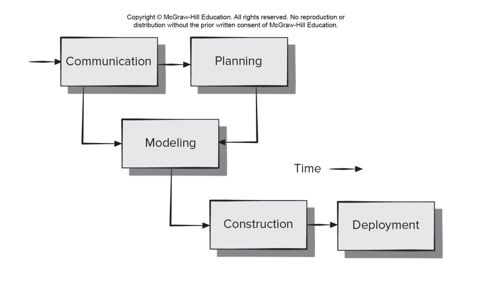
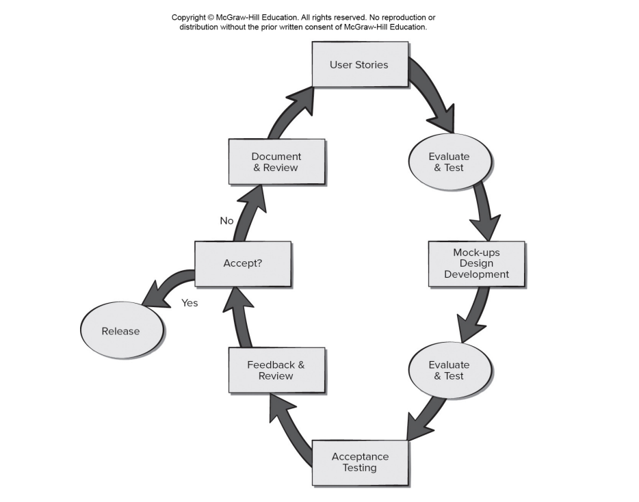

<!-- 

📋 This is the tech-news archives to help me keep track of what I am interested in!

- Reference tech news link: <https://thenextweb.com/news/blockchain-development-tech-career>
  

{{ notice-2 | markdownify }}
 -->

📋 This is my note-taking from what I learned in the class "Software Engineering Fundamentals - COMP 120-002"
{: .notice--danger}

## Principles that Guide Process (1)

1. Be flexible and adaptable.
2. Focus on producing high-quality work.
3. Be willing to change your approach when necessary.
4. Build a strong, effective team.
5. Establish good communication and coordination.
6. Manage changes carefully.
7. Identify and plan for potential risks.
8. Create work that adds value to the project.

 

## Principles that Guide Practice (2)

1. Break down complex tasks into smaller, more manageable parts.
2. Use simple explanations to communicate complex ideas.
3. Keep things consistent so users can understand and use the software easily.
4. Pay close attention to how information is shared between different parts of the software.
5. Organize the software into separate, modular components to make it easier to understand and maintain.
6. Look for common solutions to recurring problems and use them.
7. Consider different perspectives when designing the software.
8. Remember that someone else will have to work with the software after you, so make it easy to understand and maintain.

 

## Simplified Process Framework

 

## Communication Principles

1. Listen to the speaker.
2. Prepare before communicating.
3. Have a leader to facilitate the conversation.
4. Face-to-face communication is best, but visuals can help.
5. Take notes and write down important points and decisions.
6. Collaborate and combine knowledge.
7. Stay focused and modularize discussions.
8. Use pictures if something is unclear.
9. Move on after making a decision or if something is unclear.
10. Negotiation should benefit both parties.

 

## Communications Mode Effectiveness

 

## Planning Principles

1. Know what you want to achieve.
2. Ask the customer what they need and want.
3. Understand that plans may change.
4. Estimate based on what you know.
5. Plan for potential problems.
6. Be realistic about what can be done.
7. Decide how much detail to include in the plan.
8. Make sure to prioritize quality.
9. Plan for unexpected changes.
10. Keep track of progress and adjust the plan as needed.

 

## Iterative Planning Process

 

## Modeling Principles

### <u>Software Modeling</u>

### <u>Agile Modeling Principles</u>

1. Focus on building software, not creating models.
2. Create only the necessary models and avoid creating too many.
3. Aim to create simple models that accurately describe the problem or software.
4. Build models in a flexible way that allows for easy changes.
5. Clearly state the purpose of each model you create.
6. Adapt your models to fit the system you're working on.
7. Prioritize creating useful models over perfect ones.
8. Don't get caught up in technical details of model syntax, focus on clear communication.
9. Trust your instincts if you feel a model isn't right.
10. Seek feedback as early as possible to improve your models.



In software engineering work, two classes of models can be created:

1. "Requirements models (also called analysis models)" represent the customer requirements by depicting the software in three different domains: the information domain, the functional domain, and the behavioral domain.
2. "Design models" represent characteristics of the software that help practitioners to construct it effectively: the architecture, the user interface, and component-level detail.
   

{{ notice-2 | markdownify }}

### <u>Requirements Modeling Principles</u>

1. Understand the problem and the information it involves.
2. Define what the software needs to do.
3. Represent how the software responds to external events.
4. Organize the information, function, and behavior into a clear hierarchy.
5. Start with the big picture and gradually work towards the details.

### <u>Design Modeling Principles</u>

1. Design should match the requirements.
2. Consider the system's architecture.
3. Data and processing design are equally important.
4. Carefully design internal and external interfaces.
5. Prioritize user-friendly interface design.
6. Components should be self-contained.
7. Components should be loosely connected.
8. Design models should be easy to understand.
9. Design should be done in stages, not all at once.
10. Agile approaches can be used alongside design modeling.

### <u>Living Modeling Principles</u>

1. Think about the people who will use your models.
2. Make sure your models and code work well together.
3. Have the models and code talk to each other.
4. Make sure everyone has the same understanding of the system.
5. Keep track of changes to the system.
6. Make sure all the models agree with each other.
7. Assign someone to take care of each part of the model.
8. Show how the system can change over time.

 

## Construction Principles - Coding

Construction activity means creating software that is ready to give to the customer. To do this, we have to write code and test it.

Coding is about how we write the code and what we use to write it. Testing is about designing tests to find mistakes in the software. We want to find as many problems as possible, but we also want to do it quickly and easily.

<u>Preparation Principles: Before you write one line of code, be sure you:</u>

1. Know what you're trying to do.
2. Understand how to design things.
3. Choose a programming language that works for your project and where it will be used.
4. Pick a programming environment that helps you work better.
5. Make some tests to check your code.

<u>Coding Principles: As you being writing code, be sure you:</u>

1. Use structured programming to make your algorithms clear and organized.
2. Work with a partner to catch mistakes and write code faster.
3. Pick data structures that fit your software design.
4. Understand the big picture of your software and make sure everything fits together.
5. Keep things simple when using "if" statements or other conditions.
6. Write nested loops in a way that is easy to check for errors.
7. Use meaningful names for variables and follow coding standards.
8. Write code that is easy to understand without extra explanations.
9. Use spacing and formatting to make your code easy to read.

<u>Validation Principles: After you've completed your first coding pass, be sure you:</u>

1. Conduct a code walkthrough when appropriate.
2. Perform unit tests and correct errors you’ve uncovered.
3. Refactor the code to improve its quality.

<u>Testing Principles: Myers [Mye79] states these rules of testing that can also serve as testing objectives:</u>

1. Testing means running a program to find mistakes.
2. A good test case is one that's likely to find a mistake that hasn't been found yet.
3. A successful test is one that finds a mistake that hasn't been found yet.

### <u>Testing Principles</u>

Davis suggests a set of testing principles that have been added to by Everett and Meyer:

1. Tests should be based on customer requirements.
2. Plan tests well in advance of actually testing.
3. The Pareto principle (80/20 rule) applies to software testing.
4. Start testing with small parts of the system and progress to larger parts.
5. It's impossible to test everything exhaustively.
6. Allocate testing effort based on expected fault density.
7. Static testing (code analysis without running it) can be very effective.
8. Keep track of defects and patterns of defects found during testing.
9. Include test cases that show the software is behaving correctly.

### <u>Agile Testing</u>

 

## Deployment Principles

1. Make sure customers know what to expect from the software.
2. Test the software and make sure everything is included in the final delivery.
3. Create a plan to provide support for the software after it is delivered.
4. Give users instructions on how to use the software effectively.
5. Fix any problems with the software before delivering it to users.

 

## Software Deployment Actions

 

---

 

    🖋️ This is my self-taught blog! Feel free to let me know
    if there are some errors or wrong parts 😆

[Back to Top](#){: .btn .btn--primary }{: .align-right}
